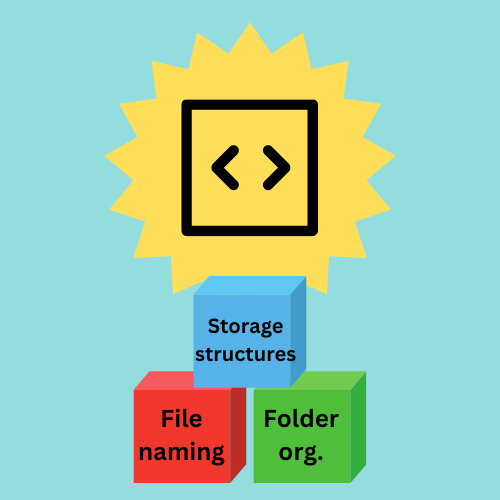
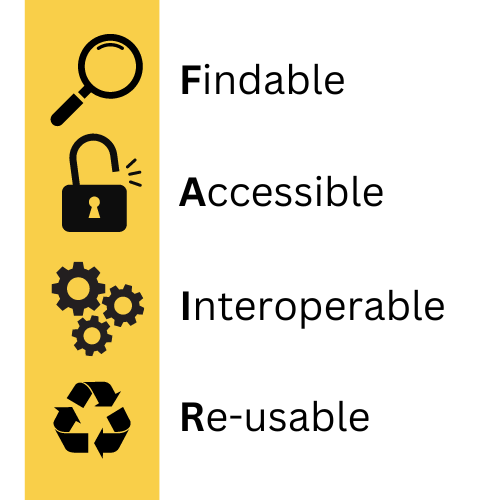

# Part I - Welcome to File Naming & Folder Organization

### 1a. Learning Objectives & Purpose

This mini module is an opportunity for self-paced, independent learning in several core skills. During class, your instructors will expand upon the module topics and will show you how to apply the skills to much more complex problems in your field of study. The learning in this mini-module will equip you to do the following: 

- Recognise the importance of file and folder organisation and relate it to your studies.

- Use appropriate naming conventions to manage project files systemically.

- Structure folders effectively to make elements of a research project findable for collaborators and for your future self.

- Explain the concept of a directory tree. 

- Evaluate whether to store a file locally vs. remotely based on factors such as accessibility, security, and collaboration needs.

### 1b. Pre-quiz

Before we begin, please take this short pre-quiz (5 questions). The purpose is to evaluate your background knowledge and see which concepts will be new vs. review for you.

    <iframe src="https://tudelft.h5p.com/content/1292336851439686927/embed" aria-label="Pre quiz" allowfullscreen="allowfullscreen" allow="autoplay *; geolocation *; microphone *; camera *; midi *; encrypted-media *"></iframe>

### 1c. Relevance:

  

    ?
    Why should we care about file naming & folder organisation?
  

 

<table>
  <tr>
    <td class="image-cell">
      
      
<em>"Research insights" by TU Delft Library - Education Support is licensed under <a href="https://creativecommons.org/licenses/by/4.0/">CC BY 4.0</a></em>

    </td>
    <td class="text-cell">
      <h3>INSIGHTS INTO YOUR RESEARCH PROCESS</h3>
      
Ideally, files are named and organised in a way that helps document the process or sequence that you followed to gather the data. File names should provide hints about why/how each piece is relevant. Effective file naming and documentation of file naming schema makes it easier to retrace your steps in a project when it’s time to analyse your results.

    </td>
  </tr>
</table>

<table>
  <tr>
    <td class="image-cell">
      
      
<em>"File finding" by TU Delft Library - Education Support is licensed under <a href="https://creativecommons.org/licenses/by/4.0/">CC BY 4.0</a></em>

    </td>
    <td class="text-cell">
      <h3>INCREASED EFFICIENCY</h3>
      
It’s no fun hunting frantically for that one specific piece of information that you collected last month: spending a little time upfront to organise your files increases their findability. This can save you a lot of time (and lower your stress level) in the long run.

    </td>
  </tr>
</table>

<table>
  <tr>
    <td>
      
      
<em>"Data management helps your future self" by TU Delft Library - Education Support is licensed under <a href="https://creativecommons.org/licenses/by/4.0/">CC BY 4.0</a></em>

    </td>
    <td class="text-cell">
      <h3>BETTER ORGANISATION</h3>
      
File naming and folder organisation best practices will help you to be more organised in your BSc thesis research and in general: in your studies you will likely be working with larger quantities of data over longer periods of time. You may have it all in your head now, but forget major details two months from now. It’s helpful to have <b>systemic, well-documented methods</b> for naming and organising your files now so that your future self can easily understand and locate what you did.

    </td>
  </tr>
</table>

<table>
  <tr>
    <td class="image-cell">
      
      
<em>"Collaborative efforts" by TU Delft Library - Education Support is licensed under <a href="https://creativecommons.org/licenses/by/4.0/">CC BY 4.0</a></em>

    </td>
    <td class="text-cell">
      <h3>EFFECTIVE COLLABORATION</h3>
      
Your file naming choices and folder structure should help a collaborator or supervisor to follow the steps of your research and understand the pieces of your work. When working on collaborative projects, establishing a common/standard folder structure and naming conventions can facilitate collaborative work because everybody knows where to easily find the data they need for the different pieces of the project, making the collaboration more effective. There is no single "right" way to name files and organise folders, but your system of organising data and files needs to work for everyone involved in the work.

    </td>
  </tr>
</table>

<table>
  <tr>
    <td class="image-cell">
      
      
<em>"Building blocks of computer programming" by TU Delft Library - Education Support is licensed under <a href="https://creativecommons.org/licenses/by/4.0/">CC BY 4.0</a></em>

    </td>
    <td class="text-cell">
      <h3>REINFORCING COMPUTER SCIENCE PRINCIPLES</h3>
      
The concepts in this module reinforce skills and habits of thinking that you will need for computer programming. For example, understanding folder structures can help you become a more intuitive user of a <b>command line interface</b>. It can also help you to more intentionally organise and store code and documentation for <b>collaborative projects</b>. Moreover, this mini-module will prepare you to practice better <b>version control</b> by reinforcing habits of systemic naming.

    </td>
  </tr>
</table>

<table>
  <tr>
    <td class="image-cell">
      
      
<em>"FAIR" by TU Delft Library - Education Support is licensed under <a href="https://creativecommons.org/licenses/by/4.0/">CC BY 4.0</a></em>

    </td>
    <td class="text-cell">
      <h3>ESSENTIAL TOOLS FOR FAIR DATA SHARING</h3>
      
Good folder organization and file naming makes research data and files more FAIR (this stands for Findable, Accessible, Interoperable, and Re-usable). Researchers who work according to FAIR principles can have a greater scientific impact, and their work gets cited more. As a BSc student, you’ll be able to work smarter if you make your files and data more findable and accessible. In the modern digital landscape, it’s also beneficial to develop good digital hygiene around data storage and sharing.

    </td>
  </tr>
</table>

### 1d. Your turn to process!

This section discussed many reasons to expand your knowledge of file naming and folder organisation. The next parts of this module aim to provide tools and guidelines which will be immediately applicable to your bachelor’s coursework. 

Before proceeding, please reflect on which of the reasons discussed is most important for you and why:

  <iframe src="https://tudelft.h5p.com/content/1292336776353802547/embed" aria-label="Quiz 1d" allowfullscreen="allowfullscreen" allow="autoplay *; geolocation *; microphone *; camera *; midi *; encrypted-media *"></iframe>

 
