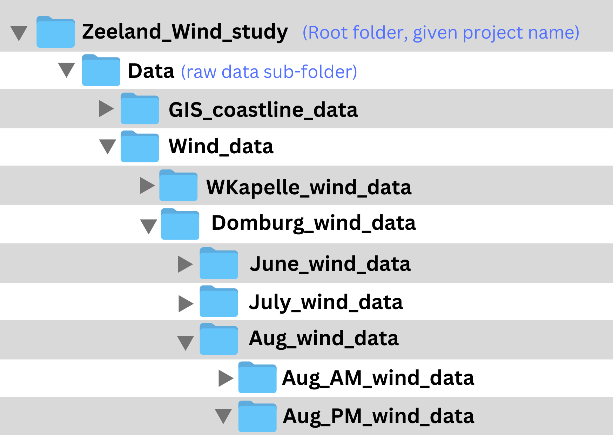
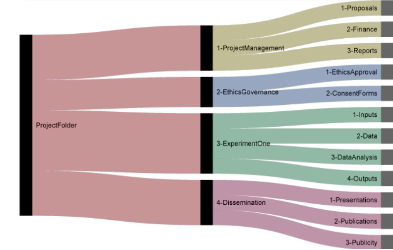

# Part 3

## Folder Organisation

### 3a. Relevance

<center><b>Why does folder organisation matter to me and my collaborators?</b></center>

<style>
  td {
    width: 50%;
    vertical-align: top;
    padding: 0;
    text-align: center; /* Centers the text and images within the cells */
  }

  .text-container {
    width: 80%; /* Adjusts the width of the text section */
    margin: 0 auto; /* Centers the text section within the cell */
    height: 100px; /* Keeps a consistent height for alignment */
  }

  img {
    width: 70%; /* Sets the image width to 70% of the cell */
    height: auto; /* Maintains the aspect ratio */
    display: block; /* Makes the image behave as a block element */
    margin: 0 auto; /* Centers the image within the cell */
}
</style>

<table>
  <tr>
    <td>
      <div class="text-container">
        <h3><b>BEFORE:</b></h3>
        <p>With a cluttered desktop like this, it can be difficult to see what’s where, and hard to stay organised.</p>
      </div><br>
      
      <p style="font-size: small;"><em>"Desktop Chaos" by TU Delft Library - Education Support is licensed under <a href="https://creativecommons.org/licenses/by/4.0/">CC BY 4.0</a></em></p>
    </td>
    <td>
      <div class="text-container">
        <h3><b>AFTER:</b></h3>
        <p>With an organised system of folders, it's easier to locate exactly what you need.</p>
      </div><br>
      
      <p style="font-size: small;"><em>"Desktop Harmony" by TU Delft Library - Data Analysis Team is licensed under <a href="https://creativecommons.org/licenses/by/4.0/">CC BY 4.0</a></em></p>
    </td>
  </tr>
</table>

A system of sub-folders helps you organise items into more intentional and manageable categories. This will make it possible to find elements more easily and save you time in the long run, especially during big projects.

Just like with file naming conventions, it’s important to **consider your folder structure in advance**. Your folders will be determined by what kinds of information you will collect and what you (and your collaborators, if applicable) eventually want to do with the data. **Your folder structure will depend on your project: there is no single right folder structure.** 

**Why does folder structure matter in programming?**

Will you use code and scripts to analyse research data? Well-organised folders will give you a much more efficient way to summon and work with specific data sets. For example, you may want to use a ```for-loop``` command or a ```glob``` to summon all the data housed in a folder. These commands work best if the data has already been sorted into clearly named folders.

### 3b. Folder Rules of Thumb

<center><b>What are effective systems to organise the folders for my project?</b></center>

Watch the video to learn about how to create a basic hierarchical folder structure for a project.

<center><b>VIDEO PLACEHOLDER</center></b>

At the top of the hierarchy is a folder which is given the project’s name. This is called the “Root folder.” The root folder will act as a container for all the other folders in the project.

*Often the root folder contains a README.txt file that gives key details about the project. The README gives meta-data or key terms that someone else would need to understand the project and folder structure. Inside the root folder, there are sub-folders:

- Some research projects have non-technical elements to manage, like funding or approvals. For these types of projects, an Administration (or Management) sub-folder is useful. Sub-sub folders that live in the administration folder might include Approvals, Funding, Materials ordering, and other categories that are relevant to the specific project.

- Next, a common practice among researchers is to have a sub-folder named “Data.” The Data sub-folder should contain all the raw data for a project.
  - It is strongly recommended to always keep raw data separate from the pre-processed or cleaned data, and separated from the analysis. It’s also recommended to save any raw data in a Read Only format so it never accidentally gets written over.
  - If there's a lot of war data, the Data sub-folder can be further divided into sub-sub-folders, as seen in this model. The sub-sub-folders should be planned intentionally to make it easier to do the planned analysis for a project. For example, in some project workflows it might be logical to create sub-sub folders that are named for each of the different variables that were tested, each of the species that were observed, each of the locations where observations were collected, etcetera. It all depends on the nature of the raw data and how you plan to analyse it.
  - n each folder of raw data, it’s customary to include a README file that documents the file naming conventions that were used to name that set of raw data.

- Next, researchers commonly include a sub-folder titled “Methods” inside the root folder. A sub-sub-folder within Methods would be Preprocessed data, which will include any data that have been cleaned or reformatted. Another sub-sub-folder would be Analysis. Then, for projects that use scripts and source code to analyse data, it’s also recommended to include a Scripts or Source code folder.

- Finally, as part of basic hierarchical folder structure for a project it’s recommended to include a sub-folder called Outputs. Inside the Outputs sub-folder there are usually sub-sub-folders dedicated to aspects of publication or outreach. For example, sub-sub-folders could include written reports, graphs or visuals, scientific publications, and conference presentations if applicable.

- Overall, this model follows a hierarchical structure that is organised from most general (the root folder) to more specific (the sub-sub-folders).

- You may have noticed that the folder names are fairly short. However, they are also descriptive enough that you can easily tell what types of files will be saved in each folder.

- Did you also notice that the folder names use underscores instead of spaces, where these green circles are? Also, they do not use any “weird” characters? Folder naming conventions are very similar to file naming conventions. As with file names, folder names must be readable for both humans and for machines. Machines often have trouble interpreting spaces and special characters, so it’s best to avoid them in file and folder naming.

<b>Check your understanding:</b> Answer the True or False questions to check your understanding of the rules of thumb for folder organisation.

<style>
.responsive-iframe {
    position: relative;
    width: 100%;
    overflow: hidden;
    /* padding-top: 58.5%;  */
}
.responsive-iframe iframe {
    /* position: absolute;
    top: 0;
    left: 0;
    width: 100%;
    height: 100%; */
    position: relative;
    width: 100%;
    height: auto;
    border: 0;
}
.caption {
    text-align: center; /* Center the caption text */
    font-size: 14px; /* Adjust font size as needed */
    margin-top: 8px; /* Space above the caption */
    color: #555; /* Optional: adjust caption color */
}
</style>

<div class="responsive-iframe">
  <iframe src="https://tudelft.h5p.com/content/1292363764289864897/embed" aria-label="Part3b"  allowfullscreen="allowfullscreen" allow="autoplay *; geolocation *; microphone *; camera *; midi *; encrypted-media *"></iframe>
</div>
<script src="https://tudelft.h5p.com/js/h5p-resizer.js" charset="UTF-8"></script>

### 3c. Common Folder Pitfalls:

The following video segment was created by the Ghent University data stewards. First, it reiterates best practices for folder organisation. Then, it mentions three big pitfalls to avoid with folder organisation and naming.

<!-- <div class="responsive-iframe"> -->
  <iframe src="https://www.youtube.com/embed/YslfY4W-NAg" aria-label="Part3c_video" allowfullscreen="allowfullscreen" allow="autoplay *; geolocation *; microphone *; camera *; midi *; encrypted-media *"></iframe>
<!-- </div> -->
<p class="caption">Attribution: Ghent University (CC-BY)</p>

Let’s elaborate on the three pitfalls mentioned in the video and demonstrate with examples.

#### Pitfall #1: Too deep folder structure: the sub-sub-sub-sub-sub-sub-folder dilemma

The video clip from the University of Ghent mentioned avoiding too many sub-folders. If getting there takes too many clicks, it may not be the most efficient way of working. The goal should be to make it easy and fast for you and your collaborators to navigate through all the folders of a project. An intentional, not-too-deep folder structure makes the components of your project more findable. For projects involving code or script, issues might also arise with trying to access a file via the command line if the folder structure is very deep.

Here’s an example of a hierarchical folder structure that’s being used by a group of researchers. They are conducting feasibility studies at two sites to determine the best location for a new wind park in Zeeland.

<center>

<p style="font-size: small;"><em>"How many clicks?" by TU Delft Library - Education Support is licensed under <a href="https://creativecommons.org/licenses/by/4.0/">CC BY 4.0</a>.</em></p>
</center>

Check your understanding of <b>pitfall #1</b>:

<br>

<div class="responsive-iframe">
  <iframe src="https://tudelft.h5p.com/content/1292367187191242507/embed" aria-label="pitfall_1"  allowfullscreen="allowfullscreen" allow="autoplay *; geolocation *; microphone *; camera *; midi *; encrypted-media *"></iframe>
</div>
<script src="https://tudelft.h5p.com/js/h5p-resizer.js" charset="UTF-8"></script>

<br>

#### Pitfall #2: Too many files in one folder

If you are working with files “manually” without using script or code, beware of folders getting too full. Repeated scrolling is not a good use of your time. If a single folder gets so full that you cannot easily see the files in it, consider making another folder or another sub-level of folders. This will re-organise large numbers of files into smaller, more manageable chunks so you can navigate to the file(s) you need more quickly.

Please note: Full folders are not a problem for projects with folders containing data files that will be read primarily by code or scripts. In these cases, a folder might contain thousands of files. What really matters, then, is how well the files have been named and categorised.

#### Pitfall #3: Overlapping or redundant folder names.

As mentioned before, it’s a good idea to create a root folder and give it the name of the specific project. Within that root folder, all sub-folders should have their own unique and recognizable names, just like you saw earlier in the video about Folder Rules of Thumb. Otherwise, it can quickly get very confusing.

<style>
  td.image-cell2 {
    width: 50%; /* Sets the image cell to 30% of the table width */
    vertical-align: top; /* Aligns the image to the top */
  }

  td.text-cell2 {
    width: 70%; /* Sets the text cell to 70% of the table width */
    vertical-align: top; /* Aligns the text to the top */
    padding-left: 20px; /* Optional: Adds some spacing between image and text */
  }

</style>

<table>
  <tr>
    <td class="image-cell2">
      
      <p style="font-size: small"><em>"Redundant Folders = Confusion" by TU Delft Library - Education Support is licensed under <a href="https://creativecommons.org/licenses/by/4.0/">CC BY 4.0</a></em></p>
    </td>
    <td class="text-cell2" style="text-align:left">
      <p>Anke is doing a project about patterns of precipitation linked to cloud formations in the Netherlands. She was granted permission to re-use rainfall data and cloud radar data collected at several government weather stations in Zuid-Holland. She plans to put the raw data files for rainfall in a folder named “Data.” She will save the raw data for the cloud formations into another folder, and name that folder “data.” She pre-processes the datasets by copying and pasting some of the data into a csv file. She saves this pre-processed data in a folder named “DATA.” These folder names are problematic.</p>
    </td>
  </tr>
</table>

<br>

<b>Check your understanding of pitfall #3:</b>

<br>

<div class="responsive-iframe">
  <iframe src="https://tudelft.h5p.com/content/1292362134790431977/embed" aria-label="pitfall_3"  allowfullscreen="allowfullscreen" allow="autoplay *; geolocation *; microphone *; camera *; midi *; encrypted-media *"></iframe>
</div>
<script src="https://tudelft.h5p.com/js/h5p-resizer.js" charset="UTF-8"></script>

### 3d. Process what you've learned about folder organisation!

<b>Check your understanding: Scenario</b>

Nikola Vukovic is a Neuroscientist from the University of California San Francisco. To stay organised during his research, he has established this hierarchical folder structure. The folder structure reflects the key elements of his research projects:

<center>

<p style="font-size: small">Folder structure. From <em>"Setting up an organised folder structure for research projects"</em> by N. Vukovic, n.d. (<a href=http://nikola.me/folder_structure.html>http://nikola.me/folder_structure.html</a>). Reprinted with permission. </p>
</center>

#### How does this folder structure match Nikola's work flow?

- When Nikola puts his folder structure into action, “ProjectFolder” would actually be given his specific project’s title.

- Nikola usually applies for and receives grants to conduct his research projects, so he likes to include a Project Management sub-folder.
  - He uses a sub-sub-folder for Proposals where he saves his project plan and grant application requirements.
  - Finance also gets its own sub-sub-folder because Nikola needs to track the funding and expenses for most projects.

- Since his research tends to deal extensively with human research subjects, Nikola makes a habit of dedicating a sub-folder to Ethics governance.
  - Within that, he includes one sub-sub-folder for ethics forms and another for approvals.

Nikola offers further insights into his established folder structure on his website. If you are interested in learning more, you can visit: http://nikola.me/folder_structure.html

<b>Processing questions:</b>

Based on the visual outline of Nikola's folder structure, make predictions about where you would find different types of files.

<div class="responsive-iframe">
  <iframe src="https://tudelft.h5p.com/content/1292367152750218497/embed" aria-label="Nikola_processing_questions"  allowfullscreen="allowfullscreen" allow="autoplay *; geolocation *; microphone *; camera *; midi *; encrypted-media *"></iframe>
</div>
<script src="https://tudelft.h5p.com/js/h5p-resizer.js" charset="UTF-8"></script>