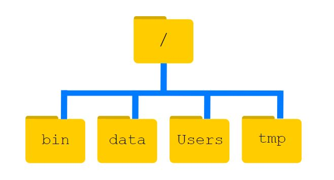
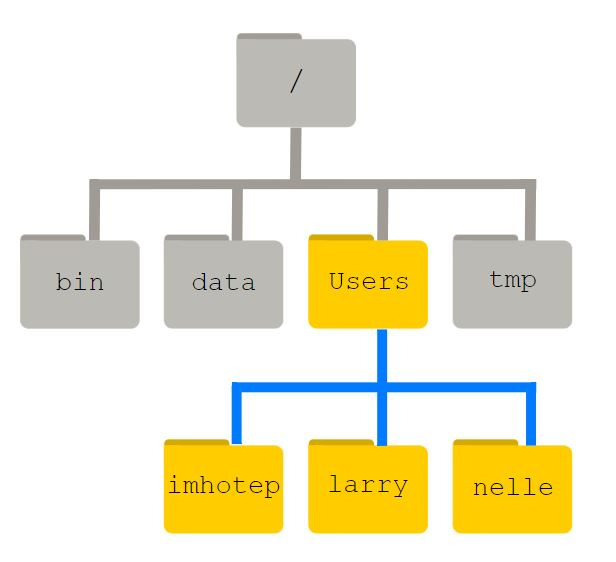

# Part 4

## Hey... where's my file? Understanding storage structures

### 4a. Relevance

  

    ?
    Why Should you Care?
  

 

In the previous section of this module, we looked at hierarchical methods of folder organisation and how to name your files. We learned that proper file organization and naming is more than just a good habit; it's a critical skill for any student and future researcher. Knowing where your files are and being able to visualize how they are organized ensures you can quickly retrieve information, maintain data integrity, and save time when managing software or data projects, or preserving crucial papers.

  

    ?
    Why does directory tree matter in programming?
  

 

From a computational perspective, understanding how files are structured within a directory tree enhances your ability to navigate file systems efficiently and ensures organized, accessible, and secure data management. A directory tree is a hierarchical structure representing the organization of files and directories (also called folders) within a computer's file system, starting from a root directory and branching out into various subdirectories. The file system manages this hierarchy, organizing data into files (which hold information) and directories (or folders) that contain files or other directories.

### 4b. Directory Tree (how are the drives on a computer organised)

  

    ?
    What is a Directory Tree (also known as Tree Direcctory or Directory)?
  

 

Let's break down the concept of a directory tree using a simple analogy to help visualize it. Think of a directory tree as a family tree. Just as a family tree starts with a common ancestor and branches out to show different family members, a directory tree starts with a single "root" and branches out to show various directories and subdirectories, each containing files or additional directories.

- <b>The Root Node:</b> It’s the top-most directory in the hierarchy, and it’s the starting point for all directories and files on your computer. Everything branches off from here. Just like the topmost ancestor (such as a grandparent), it is the starting point for the family tree. On Windows, the root directory is represented as ‘C:\’, and on Unix-based systems like macOS or Linux, it’s represented as ‘/’.

- <b>Parent Nodes:</b> Moving down from the root in a family tree, you have parents who are directly connected to the ancestor. Similarly, in a directory tree, <b>parent nodes</b> represent directories that contain other directories or files. A parent node (like a parent in a family tree) has its own set of <b>child nodes</b>.

- <b>Child Nodes:</b> In a family tree, children are connected to their parents, forming a branching structure. In a directory tree, <b>child nodes</b> represent the directories or files contained within a parent directory. Each child node can be a subdirectory (a child directory) or a file, like how children in a family tree can have their own families or be individual members.

- <b>Leaf Nodes (End Members):</b> In a family tree, the individuals who do not have children of their own are like <b>leaf nodes</b> in a directory tree. Leaf nodes are typically files because they do not contain any further subdirectories or files. They are the endpoints of the tree, representing the actual content, such as documents, images, or videos.

You might ask yourself what the difference between directory tree and folder structure is. In summary, a directory tree represents the entire file system hierarchy. It starts from the root directory and branches out into subdirectories and files. The directory tree is used by operating systems (such as Windows) to manage the entire file system organization. While a folder structure focuses on practical organization for a specific purpose or project. Both concepts help us manage and navigate our digital content effectively.

<b>Example</b>

To understand what a ‘directory tree’ is, let’s have a look at how the file system is organized. For the sake of this example, we’ll be illustrating the filesystem on our scientist Nelle’s computer.

The filesystem looks like an upside-down tree. The topmost directory is the root directory that holds everything else. We refer to it using a slash character / on its own; this character is the leading slash in <code>/Users/nelle</code>. Inside that directory are several other directories: bin (which is where some built-in programs are stored), data (for miscellaneous data files), Users (where users’ personal directories are located), tmp (for temporary files that don’t need to be stored long-term), and so on.

We know that our current working directory <code>/Users/nelle</code> is stored inside <code>/Users></code> because <code>/Users</code> is the first part of its name. Similarly, we know that <code>/Users</code> is stored inside the root directory <code>/</code> because its name begins with <code>/</code>.

Notice that there are two meanings for the <code>/</code> character. When it appears at the front of a file or directory name, it refers to the root directory. When it appears inside a path, it’s just a separator.

Underneath <code>/Users</code>, we find one directory for each user with an account on Nelle’s machine, her colleagues Imhotep and Larry.

<em>“The Unix Shell: Navigating Files and Directories” by Software Carpentry is licensed under CC BY 4.0 <a href=https://swcarpentry.github.io/shell-novice/02-filedir.html>https://swcarpentry.github.io/shell-novice/02-filedir.html</a></em>

The user imhotep’s files are stored in <code>/Users/imhotep</code>, user larry’s in <code>/Users/larry</code>, and Nelle’s in <code>/Users/nelle</code> and so-called parents' nodes.

### 4c. Directory Tree Processing:

Now that you've read about directory trees, it's time to check your understanding. Please answer the following multiple-choice questions to the best of your ability.

Check your understanding of directory tree:

  <iframe src="https://tudelft.h5p.com/content/1292367933376792477/embed" aria-label="DirectoryTreeProcessing"  allowfullscreen="allowfullscreen" allow="autoplay *; geolocation *; microphone *; camera *; midi *; encrypted-media *"></iframe>

### 4d. Local vs. Remote access

  

    ?
    What are distinguishing features of remove vs. local access? Where are the best storage location(s) for my files?
  

 

When studying or working at TU Delft, understanding the difference between remote and local access is crucial for effectively managing your files and data. Whether you’re working on a research project, collaborating on a group assignment, or simply keeping your notes organised, understanding the difference between remote and local access and how they apply at TU Delft will help you make informed decisions about where to store your files and how to access them efficiently.

Below is a table comparing local and remote access. Read through the table to learn about the differences between the two. After that, answer the practice questions.

<table>
    <thead>
        <tr>
            <th></th>
            <th class="local">Local Access</th>
            <th class="remote">Remote Access</th>
        </tr>
    </thead>
    <tbody>
        <tr>
            <td><strong>Definition</strong></td>
            <td class="local">Local Access refers to accessing files and data stored directly on your personal device (e.g., your laptop, desktop, or a university computer). This data is only accessible when you have physical access to that device.</td>
            <td class="remote">Remote access refers to accessing files and data stored on external servers, such as cloud storage or university network drives. This data can be accessed from any device with an internet connection.</td>
        </tr>
        <tr>
            <td rowspan="2"><strong>Examples</strong></td>
            <td class="local"><strong>Personal Laptop or Desktop:</strong> if you’re working on a MATLAB project saved on your laptop’s Documents folder.</td>
            <td class="remote"><strong>OneDrive:</strong> a cloud storage service where you can store your files as a BSc student. By saving your files on OneDrive, you can access them remotely from any device with an internet connection, on or off-campus.</td>
        </tr>
        <tr>
            <td class="local"><strong>University Computers:</strong> If you’re working in a TU Delft computer lab or library, any files you save on the local hard drive of that computer are accessed locally in the library on that specific machine: you won’t be able to find the files on a computer at CiTG.</td>
            <td class="remote"><strong>TU Delft Network Drives:</strong> network drives that are accessible remotely via VPN (Virtual Private Network) with your NetID credential. These drives are hosted on TU Delft’s servers, allowing you to access your data securely from any location, whether you are on campus or not.</td>
        </tr>
        <tr>
            <td rowspan="2"><strong>Advantages</strong></td>
            <td class="local"><strong>Speed</strong>: accessing files stored locally is usually faster because it doesn’t depend on an internet connection.</td>
            <td class="remote"><strong>Flexibility:</strong> You can access your files from anywhere on any device, if you have an internet connection.</td>
        </tr>
        <tr>
            <td class="local"><strong>Offline Availability:</strong> You can access your files even when there is no internet connection</td>
            <td class="remote"><strong>Backup and Security:</strong> Files stored on the cloud service OneDrive are automatically backed up by the ICT department at TU Delft and are protected against data loss.</td>
        </tr>
        <tr>
            <td rowspan="3"><strong>Challenges</strong></td>
            <td class="local"><strong>Limited by Device:</strong> Your data is only available on the specific device where it is stored.</td>
            <td class="remote"><strong>Internet Dependency:</strong> You need an active internet connection to access your files. When working with large data sets, remote or unreliable internet connections can be a significant limitation. For instance, if you plan to work on the train and need to create a growth for a presentation, degraded internet data subscriber bottlenecks, and slow connections can be substantial impediments.</td>
        </tr>
        <tr>
            <td class="local"><strong>Risk of Data Loss:</strong> If disaster strikes and your device fails or gets lost or stolen, you could lose your data unless you have an external/online backup</td>
            <td class="remote"><strong>Speed:</strong> Accessing large files remotely may be slower than accessing them locally, depending on your internet speed.</td>
        </tr>
        <tr>
            <td class="local"><strong>Staying Updated in Collaborative Projects:</strong> If you're working on a collaborative project, being offline means you'll miss out on the latest updates and changes made by your team.</td>
            <td class="remote"></td>
        </tr>
    </tbody>
</table>

### 4e. Processing

Check your understanding of local vs. remote storage by answering three follow-up questions:

  <iframe src="https://tudelft.h5p.com/content/1292367276805070977/embed" aria-label="DirectoryTreeProcessing"  allowfullscreen="allowfullscreen" allow="autoplay *; geolocation *; microphone *; camera *; midi *; encrypted-media *"></iframe>

