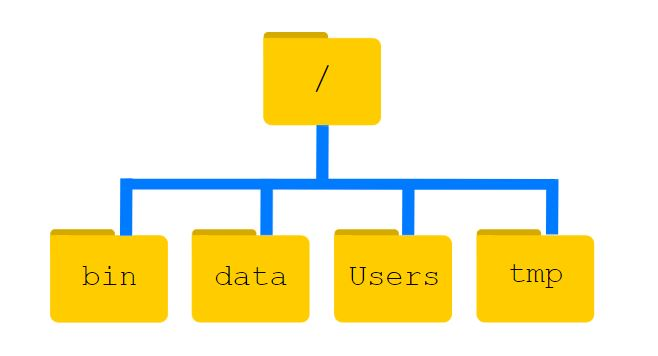

# Deel 4 - Hé... waar is mijn bestand? Opslagstructuren begrijpen

## 4a. Relevantie:

<center>
  <div style="padding: 10px; background-color: #00BBC8; border-radius: 10px; display: inline-block; font-weight: bold; font-size: 16px; color: #000; position: relative;">
    <span style="background-color: white; color: #00BBC8; border-radius: 50%; padding: 5px 10px; font-size: 15px; font-weight: bold; margin-right: 8px; display: inline-block;">?</span>
    Waarom zou je aandacht moeten besteden aan opslagstructuren?
  </div>
</center><br>

In het vorige deel van deze module hebben we onderzocht hoe je bestanden benoemt en mappen organiseert. We hebben geleerd dat het goed benoemen en organiseren van bestanden niet alleen goede gewoontes zijn; het zijn cruciale vaardigheden voor elke student of toekomstig onderzoeker. Weten waar je bestanden zijn en de organisatie ervan kunnen visualiseren zorgt ervoor dat je informatie snel kunt terugvinden, de integriteit van gegevens kunt behouden en tijd kunt besparen bij het beheren van software- of gegevensprojecten of het bewaren van cruciale documenten.

<center>
  <div style="padding: 10px; background-color: #00BBC8; border-radius: 10px; display: inline-block; font-weight: bold; font-size: 16px; color: #000; position: relative;">
    <span style="background-color: white; color: #00BBC8; border-radius: 50%; padding: 5px 10px; font-size: 15px; font-weight: bold; margin-right: 8px; display: inline-block;">?</span>
    Waarom is de mappenstructuur belangrijk bij het programmeren?
  </div>
</center><br>

Vanuit een computationeel perspectief, vergroot inzicht in hoe bestanden zijn gestructureerd binnen een mappenstructuur je vermogen om efficiënt door bestandssystemen te navigeren en zorgt het voor georganiseerd, toegankelijk en veilig gegevensbeheer. Een mappenstructuur is een hiërarchische structuur die de organisatie weergeeft van bestanden en mappen binnen het bestandssysteem van een computer, beginnend bij een hoofdmap en vertakkend in verschillende submappen. Het bestandssysteem beheert deze hiërarchie en organiseert gegevens in bestanden (die informatie bevatten) en mappen die bestanden of andere directories bevatten.

## 4b. Mappenstructuur (hoe zijn de stations op een computer georganiseerd):

<center>
  <div style="padding: 10px; background-color: #00BBC8; border-radius: 10px; display: inline-block; font-weight: bold; font-size: 16px; color: #000; position: relative;">
    <span style="background-color: white; color: #00BBC8; border-radius: 50%; padding: 5px 10px; font-size: 15px; font-weight: bold; margin-right: 8px; display: inline-block;">?</span>
    Wat is mappenstructuur (ook bekend als "Tree Directory" of "Directory")
  </div>
</center><br>

Laten we het concept van een mappenstructuur eens uitwerken aan de hand van een eenvoudige analogie: stel je een mappenstructuur voor als een stamboom. Net zoals een stamboom begint met een gemeenschappelijke voorouder en zich vertakt om verschillende familieleden te tonen, begint een mappenstructuur met een enkele “root” en vertakt zich om verschillende mappen en submappen te tonen, die elk bestanden of extra mappen bevatten.

- <b>Het hoofdknooppunt:</b> Dit is de bovenste map in de hiërarchie en het is het startpunt voor alle mappen en bestanden op je computer. Alles vertakt zich vanaf hier. Net als de bovenste voorouder (zoals een grootouder) is dit het beginpunt van de stamboom. Op Windows wordt de hoofdmap weergegeven als 'C:\' en op Unix-systemen zoals macOS of Linux als '/'.

- <b>Pouderknooppunten:</b> Vanaf de root in een stamboom heb je familieleden (ouders) die direct verbonden zijn met de voorouder en hun eigen kinderen hebben. Op dezelfde manier, in een mappenboom, vertegenwoordigen <b>ouderknooppunten</b> mappen die andere mappen of bestanden bevatten.

- <b>Kindknooppunten:</b> In een stamboom vertakken kinderen zich van hun ouders. Op dezelfde manier zijn <b>kindknooppunten</b> in een mapstructuur mappen of bestanden binnen een bovenliggende map. Een kinderknooppunt kan een subdirectory of een bestand zijn. En dus kunnen kinderknooppunten, die submappen zijn, zelf ouderknooppunten worden van andere bestanden en mappen eronder in de boom. 

- <b>Bladknopen (Eindleden):</b> In een stamboom zijn de individuen die zelf geen kinderen hebben als <b>bladknopen</b> in een mappenboom. Bladknooppunten zijn meestal bestanden omdat ze geen verdere submappen of bestanden bevatten. Zij zijn de eindpunten van de boom en vertegenwoordigen de eigenlijke inhoud, zoals documenten, afbeeldingen of video's.

Je vraagt je misschien af: <b>Wat is het verschil tussen een "directory tree" en een mappenstructuur?</b> Samengevat wordt een "directory tree" gebruikt door besturingssystemen (zoals Windows) om de hele organisatie van het bestandssysteem te beheren. Een mappenstructuur is gericht op praktische organisatie voor een specifiek doel of project. Beide concepten helpen ons onze digitale inhoud effectief te beheren en erdoor te navigeren.

<b>Scenario:</b>

<center>

</center>

Het bestandssysteem lijkt op een omgekeerde boom, met de hoofddirectory vertegenwoordigd door een schuine streep karakter ```/``` bovenaan; dit karakter is de leidende schuine streep in ```/Users/nelle```. Binnen die map bevinden zich verschillende andere mappen: bin (om ingebouwde programma's in op te slaan), data (voor diverse gegevensbestanden), Users (waar de persoonlijke mappen van gebruikers zich bevinden), tmp (voor tijdelijke bestanden die niet lang bewaard hoeven te worden), enzovoort. Deze mappen zijn de kindknooppunten van ```/```, het hoofdknooppunt.

We weten dat onze huidige werkdirectory ```/Users/nelle``` is opgeslagen in ```/Users>``` omdat ```/Users``` het eerste deel van de naam is. Op dezelfde manier weten we dat ```/Users``` is opgeslagen in de hoofdmap ```/``` omdat de naam begint met ```/```. De subdirectories ```/Users/nelle``` is een child node van ```/Users```, die zelf een child is van ```/```.

Merk op dat er twee betekenissen zijn voor het ```/Users``` karakter. Als het voor een bestands- of mapnaam staat, verwijst het naar de hoofdmap. Als het binnen een pad staat, is het gewoon een scheidingsteken.

Onder ```/Users``` vinden we een directory voor elke gebruiker met een account op Nelle's machine, haar collega's Imhotep en Larry.

De subdirectory ```/Users``` is de parent node van ```/Users/imhotep```, ```/Users/larry```, en ```/Users/nelle```, en het is de child node van ```/```, de root directory.

<center>

<p style="font-size: x-small;"><em>“The Unix Shell: Navigating Files and Directories” by Software Carpentry is licensed under CC BY 4.0 <a href=https://swcarpentry.github.io/shell-novice/02-filedir.html>https://swcarpentry.github.io/shell-novice/02-filedir.html</a></em></p>
</center>

## 4c. Controleer of je Directory Trees begrijpt:

Beantwoord de volgende meerkeuzevragen zo goed mogelijk op basis van wat je hebt geleerd over "directory trees".

<style>
.responsive-iframe {
    position: relative;
    width: 100%;
    overflow: hidden;
    /* padding-top: 58.5%;  */
}
.responsive-iframe iframe {
    /* position: absolute;
    top: 0;
    left: 0;
    width: 100%;
    height: 100%; */
    position: relative;
    width: 100%;
    height: auto;
    border: 0;
}
.caption {
    text-align: center; /* Center the caption text */
    font-size: 14px; /* Adjust font size as needed */
    margin-top: 8px; /* Space above the caption */
    color: #555; /* Optional: adjust caption color */
}
</style>

<div class="responsive-iframe">
  <iframe src="https://tudelft.h5p.com/content/1292367933376792477/embed" aria-label="DirectoryTreeProcessing"  allowfullscreen="allowfullscreen" allow="autoplay *; geolocation *; microphone *; camera *; midi *; encrypted-media *"></iframe>
</div>
<script src="https://tudelft.h5p.com/js/h5p-resizer.js" charset="UTF-8"></script>

## 4d. Lokale toegang (local access) vs. toegang op afstand (remote access):

<center>
  <div style="padding: 10px; background-color: #00BBC8; border-radius: 10px; display: inline-block; font-weight: bold; font-size: 16px; color: #000; position: relative;">
    <span style="background-color: white; color: #00BBC8; border-radius: 50%; padding: 5px 10px; font-size: 15px; font-weight: bold; margin-right: 8px; display: inline-block;">?</span>
    Wat zijn de onderscheidende kenmerken van "remote" vs. lokale toegang?<br>Waar kan ik mijn bestanden het beste opslaan?
  </div>
</center><br>

Als je studeert of werkt aan de TU Delft, is het begrijpen van het verschil tussen toegang op afstand en lokale toegang essentieel voor het effectief beheren van je bestanden en gegevens. Of je nu onderzoek doet, samenwerkt aan een groepsopdracht of gewoon jouw aantekeningen geordend bijhoudt, inzicht in het verschil tussen toegang op afstand en lokale toegang en hoe deze van toepassing zijn aan de TU Delft zal je helpen weloverwogen beslissingen te nemen over bestandsopslag en -toegang.

Hieronder staat een tabel waarin lokale en "remote" toegang worden vergeleken. Lees de tabel door om de verschillen te leren en beantwoord daarna de oefenvragen.

<style>
    table {
        width: 100%;
        border-collapse: collapse;
        margin-bottom: 20px;
    }
    th, td {
        border: 1px solid #dddddd;
        padding: 8px;
        text-align: left;
        vertical-align: top;
    }
    th {
        background-color: #f2f2f2;
    }
    .local {
        background-color: #ccffcc; /* Light green background */
    }
    .remote {
        background-color: #ffcccc; /* Light red background */
    }
</style>

<table>
    <thead>
        <tr>
            <th></th>
            <th class="local">Lokale toegang</th>
            <th class="remote">Toegang op afstand</th>
        </tr>
    </thead>
    <tbody>
        <tr>
            <td><strong>Definition</strong></td>
            <td class="local">Lokale toegang verwijst naar toegang tot bestanden en gegevens die rechtstreeks op je persoonlijke apparaat zijn opgeslagen (bijvoorbeeld je laptop, desktop of een computer van de universiteit). Deze gegevens zijn alleen toegankelijk als je fysieke toegang hebt tot dat apparaat.</td>
            <td class=“remote”>Remote access verwijst naar toegang tot bestanden en gegevens die zijn opgeslagen op externe servers, zoals cloudopslag of universitaire netwerk drives. Deze gegevens zijn toegankelijk vanaf elk apparaat met een internetverbinding.</td>
        </tr>
        <tr>
            <td rowspan="2"><strong>Voorbeelden</strong></td>
            <td class="local"><strong>Persoonlijke Laptop of Desktop:</strong> als je werkt aan een MATLAB-project dat is opgeslagen in de map "Documenten" van je laptop.</td>
            <td class="remote"><strong>OneDrive:</strong> een cloudopslagdienst waar je als BSc-student je bestanden kunt opslaan. Door je bestanden op OneDrive op te slaan, kun je ze op afstand openen vanaf elk apparaat met een internetverbinding, op of buiten de campus.</td>
        </tr>
        <tr>
            <td class="local"><strong>Universitaire computers:</strong> Als je werkt op een computer van de TU Delft in een lab of bibliotheek, zijn bestanden die je opslaat op de lokale harde schijf alleen toegankelijk op die specifieke machine: je hebt geen toegang tot die bestanden vanaf andere computers, zoals die in CiTG.</td>
            <td class="remote"><strong>Netwerkschijven van de TU Delft:</strong> Deze netwerkschijven zijn op afstand toegankelijk via VPN (Virtual Private Network) met je NetID-referentienummer. Deze schijven worden gehost op de servers van de TU Delft, waardoor je vanaf elke locatie veilig toegang heeft tot jouw gegevens, of je nu op de campus bent of niet.</td>
        </tr>
        <tr>
            <td rowspan="2"><strong>Voordelen</strong></td>
            <td class="local"><strong>Speed</strong>: Lokaal opgeslagen bestanden openen is meestal sneller omdat het niet afhankelijk is van een internetverbinding.</td>
            <td class="remote"><strong>Flexibiliteit:</strong> Je hebt overal toegang tot je bestanden, op elk apparaat als je een internetverbinding hebt.</td>
        </tr>
        <tr>
            <td class="local"><strong>Offline beschikbaarheid:</strong> Je hebt zelfs toegang tot je bestanden als er geen internetverbinding is.</td>
            <td class="remote"><strong>Back-up en beveiliging:</strong> Bestanden die zijn opgeslagen op de clouddienst OneDrive worden automatisch geback-upt door de ICT-afdeling van de TU Delft en zijn beschermd tegen gegevensverlies.</td>
        </tr>
        <tr>
            <td rowspan="3"><strong>Uitdagingeb</strong></td>
            <td class="local"><strong>Beperkt door apparaat:</strong> Je gegevens zijn alleen beschikbaar op het specifieke apparaat waar ze zijn opgeslagen.</td>
            <td class="remote"><strong>Internetafhankelijkheid:</strong> Je hebt een actieve internetverbinding nodig om op afstand toegang te krijgen tot je bestanden. Wanneer je met grote gegevenssets werkt, kunnen onbetrouwbare internetverbindingen een aanzienlijke beperking vormen. Als je bijvoorbeeld van plan bent om in de trein te werken en je moet een groei maken voor een presentatie, dan kunnen verminderde internet data abonnee knelpunten en trage verbindingen aanzienlijke belemmeringen vormen.</td>
        </tr>
        <tr>
            <td class="local"><strong>Risico op gegevensverlies:</strong> Als het noodlot toeslaat en je apparaat defect raakt of verloren of gestolen wordt, kun je je gegevens kwijtraken tenzij je een externe of online back-up hebt.</td>
            <td class="remote"><strong>Snelheid:</strong> Grote bestanden op afstand openen kan langzamer zijn dan lokaal, afhankelijk van je internetsnelheid.</td>
        </tr>
        <tr>
            <td class="local"><strong>Op de hoogte blijven in samenwerkingsprojecten:</strong> Als je aan een samenwerkingsproject werkt, betekent offline zijn dat je de laatste updates en wijzigingen van je team mist.</td>
            <td class="remote"></td>
        </tr>
    </tbody>
</table>

## 4e. Controleer je begrip van lokale vs. "remote" opslag 

Doe de quiz om te kijken of je het begrijpt:

<div class="responsive-iframe">
  <iframe src="https://tudelft.h5p.com/content/1292367276805070977/embed" aria-label="DirectoryTreeProcessing"  allowfullscreen="allowfullscreen" allow="autoplay *; geolocation *; microphone *; camera *; midi *; encrypted-media *"></iframe>
</div>
<script src="https://tudelft.h5p.com/js/h5p-resizer.js" charset="UTF-8"></script>